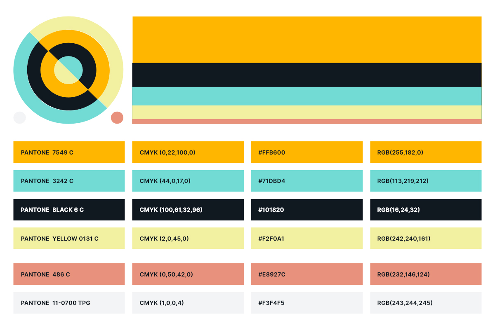

# Color

## Color codes

### Orange
- Hex: #FFB600
- RGB: 255,182,0
- CMYK: 0,22,100,0
- Pantone: PANTONE 7549 C

### Black
`#101820`

### Green
`#71DBD4`

### Yellow
`#F2F0A1`

### Grey
`#F3F4F5`

### Red
`#E8927C`

## CSS variables

```

--color-orange: #FFB600;
--color-black: #101820;
--color-green: #71DBD4;
--color-yellow: #F2F0A1;
--color-grey: #F3F4F5;
--color-red: #E8927C;

```



Parkly is mostly orange. All of the color and text combinations above are wcag triple A compliant. The red should be used as a utility color only. The bars on the right indicates the approximate ratio one should aim for.